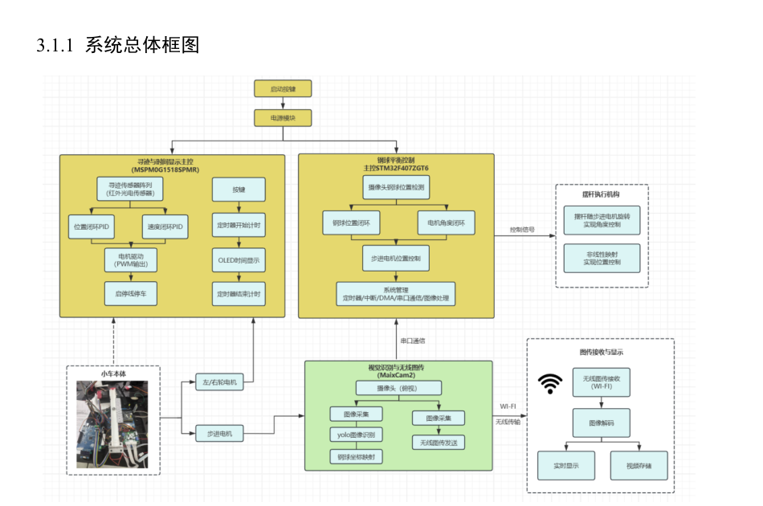
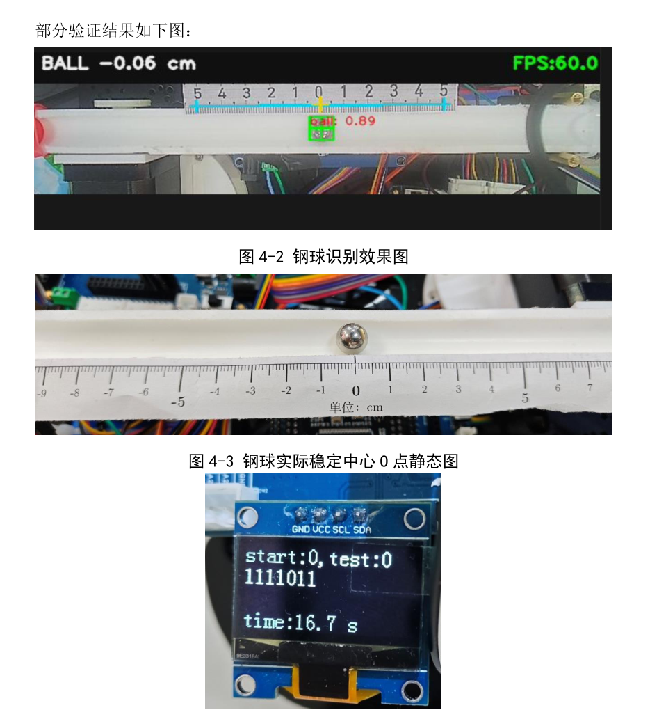
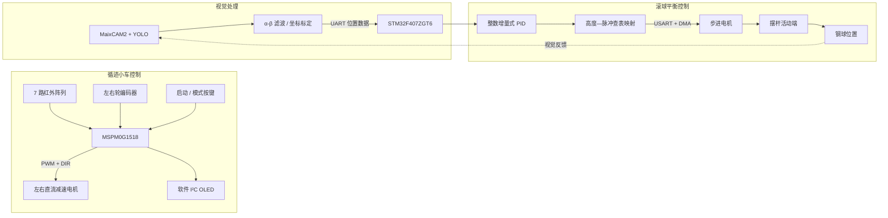
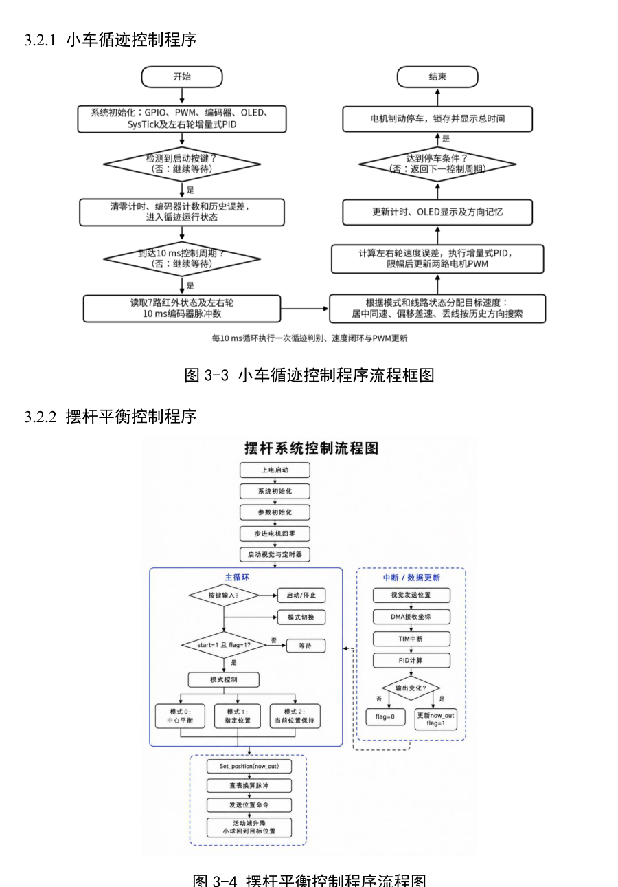
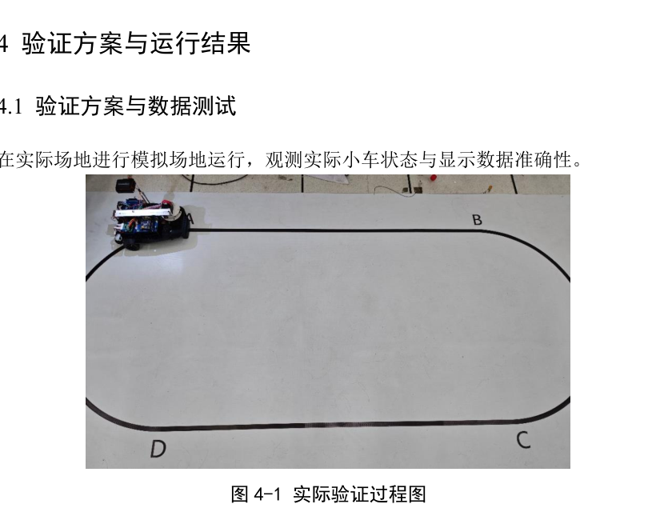

# 2026-NUEDC-H-Ball-Balance-Car

> 2026 年四川省大学生电子设计竞赛 H 题：车载平衡滚球运动控制系统  
> **四川省二等奖｜队长 / 软件负责人：刘昊晴**


## 项目简介

本项目面向车载平衡滚球控制任务，完成了**循迹小车运动控制、视觉坐标反馈、摆杆高度调节和钢球定点平衡**。系统采用多处理器去耦架构：

- **MSPM0G1518**：负责 7 路红外循迹、双编码器测速、双轮速度闭环、按键与 OLED；
- **STM32F407ZGT6**：接收视觉端钢球位置，执行位置 PID，并控制步进电机调节摆杆高度；
- **MaixCAM2**：完成钢球检测、坐标计算、位置滤波、UART 输出及无线图传。

仓库重点展示本人负责的**嵌入式控制软件、双 MCU 接口设计、控制算法落地及整机联调**。

<p align="center">
  
</p>

## 项目成果

| 项目 | 结果 |
|---|---|
| 竞赛成绩 | 2026 年四川省大学生电子设计竞赛二等奖 |
| 小车循迹 | 完成直线、弯道、急弯和丢线恢复控制 |
| 循迹速度 | 快速模式单圈实测约 **16.7 s** |
| 滚球控制 | 支持中心点、指定位置及当前位置保持 |
| 最终精度 | 比赛实测位置误差 **小于 1.5 cm** |
| 系统闭环 | 视觉检测 → UART/DMA → PID → 脉冲映射 → 步进电机执行 |

<p align="center">
  
</p>

## 系统控制架构



## 核心技术

### 1. 红外位置外环 + 车轮速度内环

小车采用串级控制结构：

- 外环读取 7 路红外数字量，通过离散状态判别识别居中、偏移、急弯和丢线；
- 根据循迹状态为左右轮分配不同目标速度，实现分段差速转向；
- 内环每 **10 ms** 采集左右编码器脉冲，分别执行增量式 PID，并更新两路 PWM；
- 丢线后依据上一次偏转方向进行反向搜索，提高重新捕获黑线的成功率。

该结构将“路径判断”和“电机一致性控制”分离，减少左右电机机械差异对循迹的影响。

### 2. 整数增量式 PID

为降低实时循环中的浮点运算开销，初始化阶段预计算 PID 合并系数，并放大后转换为整数：

```text
Δu(k) = A·e(k) + B·e(k-1) + C·e(k-2)
u(k)  = sat[u(k-1) + Δu(k)]
```

运行时仅需完成整数乘加、缩放和输出限幅。该实现同时用于：

- MSPM0 左右轮编码器速度闭环；
- STM32F407 钢球位置闭环。

### 3. UART + DMA 视觉坐标接收

STM32F407 使用 UART 接收视觉模块输出的位置数据，并通过 DMA 降低主循环等待开销。当前控制端以有符号位置偏差作为 PID 输入，定时中断负责：

1. 读取最新钢球位置；
2. 执行增量式 PID；
3. 判断输出是否发生有效变化；
4. 更新步进电机目标位置。

通信接收与控制运算解耦后，视觉帧率波动不会直接阻塞电机控制逻辑。

### 4. 非线性脉冲标定表

摆杆活动端高度与步进电机累计脉冲数并非线性关系。项目通过 MATLAB 根据偏心轮几何关系离线计算映射曲线，并在 MCU 中保存正、反方向查找表：

```text
钢球位置误差
    ↓
位置 PID 输出
    ↓
活动端目标高度
    ↓
脉冲标定表 / 线性插值
    ↓
步进电机位置指令
```

查表方式避免 STM32 在实时控制周期内反复计算反三角函数，同时保留机构几何换算精度。

### 5. 工程化可靠性处理

- 使用 SysTick 统一完成 10 ms 控制调度、计时和按键消抖；
- 软件 I²C 驱动 OLED，并在关键字节传输期间使用临界区保护时序；
- 对 I²C ACK 进行检查，避免通信异常造成程序阻塞；
- PID 输出限幅，防止控制量突变导致电机大幅动作；
- 步进电机上电后执行回零，统一机构机械基准；
- 模式切换时复位 PID 历史误差，避免残留积分或历史输出影响新任务。

<p align="center">
  
</p>

## 硬件组成

| 模块 | 型号 / 功能 |
|---|---|
| 小车主控 | MSPM0G1518SPMR |
| 平衡主控 | STM32F407ZGT6 |
| 视觉模块 | MaixCAM2 |
| 路径传感器 | 7 路红外反射式传感器 |
| 速度反馈 | 左右轮正交编码器 |
| 小车执行机构 | 两路直流减速电机 |
| 平衡执行机构 | 步进电机 + 偏心轮 / 摆杆机构 |
| 人机交互 | 按键、OLED、无线图传 |

## 软件模块

### MSPM0G1518 小车控制

| 核心文件 | 主要职责 |
|---|---|
| `clock.c` | SysTick 调度、循迹状态机、编码器采样、目标速度分配 |
| `pid.c / pid.h` | 左右轮整数增量式 PID |
| `menu.c` | 7 路红外读取、运行模式和计时显示 |
| `i2c.c` | GPIO 模拟 I²C |
| `oled_menu.c` | OLED 驱动、ACK 检查和临界区保护 |
| `main.c` | 外设初始化及人机交互循环 |

### STM32F407 摆杆平衡控制

| 核心文件 | 主要职责 |
|---|---|
| `main.c` | 模式管理、视觉位置接收、定时闭环和动作调度 |
| `pid.c / pid.h` | 钢球位置整数增量式 PID |
| `Emm_V5.c` | 步进电机串口指令封装 |
| `usart.c` | 视觉通信、调试串口和电机通信配置 |
| `dma.c` | UART DMA 通道配置 |
| `tim.c` | 周期控制定时器配置 |

## 数据流与运行流程

1. 按键启动系统并选择运行模式；
2. MSPM0 读取红外阵列，分配左右轮目标速度；
3. 编码器速度环闭环更新双轮 PWM；
4. MaixCAM2 检测钢球并输出位置偏差；
5. STM32F407 通过 UART/DMA 获取最新位置；
6. 定时中断执行位置 PID；
7. PID 输出经脉冲标定表转换为步进电机位置指令；
8. 步进电机改变摆杆活动端高度，使钢球回到目标位置。

<p align="center">
  
</p>

## 编译与复现

### 1. 克隆仓库

```bash
git clone https://github.com/leohorky/2026-NUEDC-H-Ball-Balance-Car.git
cd 2026-NUEDC-H-Ball-Balance-Car
```

### 2. MSPM0 小车工程

- 使用支持 TI SysConfig 的开发环境打开 MSPM0 工程；
- 检查 7 路红外、双路 PWM、编码器计数器、按键和软件 I²C 引脚；
- 编译并下载至 MSPM0G1518；
- 架空车轮验证编码器方向和电机转向，再进行地面循迹测试。

### 3. STM32F407 平衡工程

- 使用 STM32CubeIDE / Keil 打开工程；
- 检查视觉 UART 接收 DMA、步进电机串口发送 DMA和控制定时器；
- 上电后确认步进电机能够正常回零；
- 先发送模拟位置数据验证闭环方向，再连接真实视觉模块。

### 4. 必须重新标定的参数

不同机械结构不可直接照搬本项目参数，至少需要重新标定：

- 红外传感器安装位置与状态阈值；
- 左右轮目标脉冲数及速度环 PID；
- 钢球坐标零点、比例系数和有效范围；
- 摆杆水平位置与步进电机零点；
- 高度—脉冲查找表；
- 钢球位置 PID 参数及输出限幅。

> 调试时应先限制步进电机最大运动范围，确认闭环方向正确后再逐步提高 PID 输出上限。

## 本人职责

**刘昊晴｜队长、软件负责人**

- 主导多处理器软件架构、模块接口和控制数据流设计；
- 负责任务拆分、代码集成、进度推进与整机联调；
- 完成 MSPM0 小车循迹、编码器速度闭环及人机交互程序；
- 完成 STM32F407 视觉数据接口、位置 PID、脉冲映射及步进电机控制；
- 负责循迹策略、PID 参数和执行机构参数整定；
- 协调视觉、机械和嵌入式模块完成系统级闭环验证。

视觉识别端作为外部位置数据源，本仓库主要展示嵌入式控制和系统集成部分。

## 已知问题与后续优化

- 摆杆位置闭环稳定，但快速响应仍可继续提升；
- 可在视觉坐标接口中加入帧头、长度、校验和及超时检测；
- 可对坐标和 PID 微分项增加可配置滤波；
- 可加入前馈控制、分段 PID 或速度规划，减小启动和制动扰动；
- 可将关键标定参数保存至 Flash，并增加上位机在线调参功能；
- 可进一步整理 BSP、Control、Application 分层，降低自动生成代码与业务逻辑耦合。

## 使用说明

本项目为竞赛作品，控制参数与机械尺寸强相关，仅建议用于学习嵌入式控制、PID、视觉反馈和多处理器协同架构。使用代码前请检查电机方向、机械限位和急停措施。

## License

当前仓库未声明开源许可证。代码及项目资料版权归项目成员所有；复用、转载或二次发布前请先取得授权。
